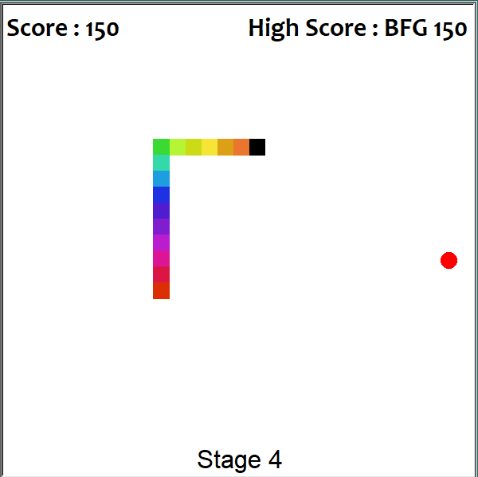

  

## Snake Game

This is my take on the classic game of Snake that I made for my AP Computer Science class back in high school. It is just like a regular game of Snake except that each time you collect 5 pellets, the speed of the snake slightly increases. The body of the snake also changes color each time you collect a pellet and makes it into a rainbow snake. 

### What it means to me

This is one of my first ever Computer Science projects and it holds a special place in my heart because it is the one that got me hooked into Computer Science. Although it may be simple and easy to do, it means a lot to me since it is a full game that I got to code from scratch and I was very proud of it. Ever since then, I've created a whole variety of projects and applications that wouldn't be here without this project.

### You can do it too.

Anyone can be a computer programmer. All you need is the dedication and the ambition to learn from your mistakes. Often times, I get demotivated because I don't know what to do or I get overambitious with my project that go beyond the original scope of what I wanted to do. The best thing is to start learning and coding small tasks like opening multiple programs at once using a simple batch script, making Python scripts that organize your files for you, or a browser extension that put on dark mode when it turns to a certain time. It doesn't matter how small the project, as long as you are coding and learning from the experience, then you are well on your way to become a computer programmer.